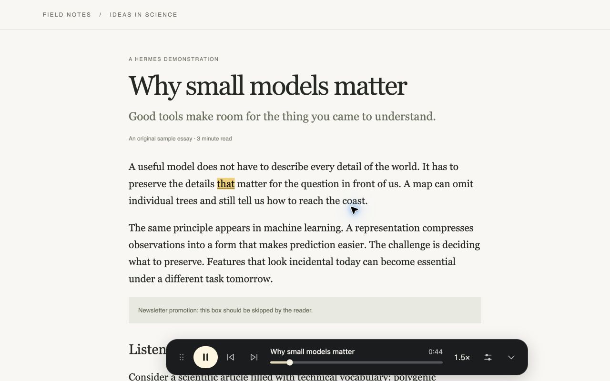
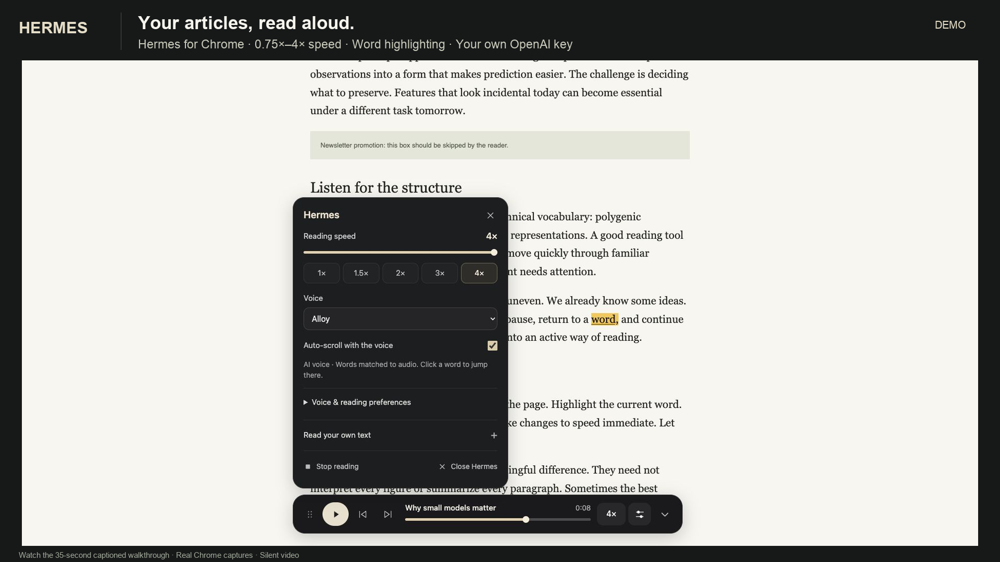

# Hermes

**Your reading. At your pace.** A small Chrome extension for listening to articles, essays, and technical writing without leaving the page.

Click **Start reading**, follow the highlighted words, and change speed from **0.75× to 4×**. Use an installed browser voice or connect OpenAI directly from Chrome. No Node, backend, or build step is needed for either option.

- A readable floating player with play, pause, stop, passage skipping, and a position slider.
- Drag it anywhere, drop it near an edge to dock, or collapse it to a small movable button while listening.
- Double-click a word to jump there, follow along with optional auto-scroll, or read selected/pasted text. Single clicks keep their normal behavior.
- Local article extraction skips common navigation, ads, controls, and captions. Substack posts use their title and article body, excluding publication footers, recommendations, and signup widgets. No LLM rewrites the article.
- OpenAI voices including **Alloy**, **Cedar**, and **Nova**, with delivery and pronunciation guidance for `gpt-4o-mini-tts`.
- Short initial audio chunks, bounded prefetch, optional background word alignment, and saved audio for repeat listening. Speed changes never trigger an API request.

## Install and listen

Requires **desktop Chrome 116+**. Chrome Web Store submission is being prepared; Hermes is not yet submitted or published there. Install the unpacked extension below. Chrome extensions do not run on iPhone or iPad, even in desktop mode; a Safari version would require a separate port. See [Google's device compatibility guidance](https://support.google.com/chrome_webstore/answer/1698338?hl=en).

1. [Download `hermes-extension.zip`](https://github.com/YashDagade/browser-reader/releases/latest/download/hermes-extension.zip) and extract it to a folder you will keep.
2. Open `chrome://extensions` and enable **Developer mode**.
3. Click **Load unpacked** and select the extracted **`extension`** folder.
4. Pin **Hermes · Article Reader** from Chrome's extensions menu.
5. Open an article, click Hermes, then **Start reading**. The default browser voice needs no API key.

You can also [clone the repository](https://github.com/YashDagade/browser-reader) and load its `extension` folder. Keep the installed folder in place. After updating its files, click **Reload** at `chrome://extensions` and reload the article tab.

### Connect OpenAI

1. Right-click Hermes in Chrome's toolbar and open **Options**.
2. Under **How to connect**, choose **Direct from Chrome · no Node or server**.
3. Enter your own OpenAI API key, or import a local `.env.local` file containing `OPENAI_API_KEY`. The file is read locally and is not uploaded.
4. Read the OpenAI data-sharing disclosure, check the consent box, and click **Save connection**. Allow the optional permission to access `api.openai.com`.
5. Choose **OpenAI · expressive** and a voice in the player. Try Alloy, Cedar, or Nova.

**The direct-mode key and custom voice instructions stay in browser-session memory.** They are not saved to disk or synced and must be supplied again after Chrome fully quits. The key is restricted to trusted extension contexts and never sent to webpage content scripts. **Disconnect OpenAI** removes it, resets consent, and removes the optional API permission. The first speech request verifies the key with OpenAI.

For file-based setup, create a file named `.env.local` on your computer with one line: `OPENAI_API_KEY=your_own_key_here` (replace the placeholder locally). If you cloned the repository, copy `.env.example` to `.env.local` first. Import that private file in Options; do not put the key in extension source files.

OpenAI speech is AI generated and billed to your API project. Voice instructions apply only to `gpt-4o-mini-tts`; older models and browser voices do not support them. Hermes asks for verbatim reading and careful pronunciation of jargon. See [OpenAI's speech guide](https://developers.openai.com/api/docs/guides/text-to-speech).

### Optional local helper

To keep the key outside Chrome, clone the full repository, install **Node.js 22+**, and set `OPENAI_API_KEY` in a private `.env.local` file at the repository root. Then run:

```sh
npm start
```

Choose **Local helper** in Options, review and accept the same OpenAI data-sharing disclosure, and save. The helper needs no dependency installation and listens only on `127.0.0.1:43123`; leave it running. On macOS, use `Start Hermes.command` or install startup at login with `npm run service:install` after stopping any terminal instance. `npm run service:restart` reloads a changed key; `npm run service:uninstall` removes background startup. Your private environment file remains on your computer and is never included in extension packages.

Install the extension separately in each Chrome profile. Direct keys and preferences stay separate per profile; multiple profiles can share one local helper. Each profile has one active reading session.

## Make it your pace

| Action | Control |
| --- | --- |
| Open Hermes | Toolbar icon, page context menu, or `Alt+Shift+R` (`Option+Shift+R` on Mac) |
| Play / pause | Main button or `Alt+Space` while the page is focused |
| Pause | `Escape` while the page is focused |
| Cycle speed | Toolbar speed button: 1× → 1.5× → 2× → 4× |
| Set any speed or change voice | Settings; the speed slider covers 0.75×–4× |
| Seek | Double-click a non-link word or use the position slider |
| Move between passages | Previous / next buttons |
| Move / dock / collapse | Drag handle, drop near any edge, or use position/collapse controls |
| Reset or close | Stop or close; closing stops playback |

Select a passage before opening Hermes to read just that selection. **Read your own text** accepts pasted text without page highlighting. Customize the opening shortcut at `chrome://extensions/shortcuts` if another app claims it.

Dropping near the left or right edge makes the toolbar vertical; top and bottom keep it horizontal. Auto-scroll moves before the spoken word reaches the bottom and briefly yields to manual scrolling. Same-page links keep the reading session alive. If its background session is lost, the controls reconnect to the current article at the saved word.

**Word timing:** **Improve timing** matches background `whisper-1` transcription timestamps to the source. Playback starts without waiting; estimates remain while alignment is pending or unavailable. This adds API usage and is not perfectly exact. Choose **Lightweight** to disable it. Browser voices use native word events when available. See [OpenAI's transcription guide](https://developers.openai.com/api/docs/guides/speech-to-text).

**Time remaining** appears as minutes:seconds. Buffered audio uses measured durations; passages not yet generated and browser speech use estimates. Playback speed is reflected in the countdown.

## Privacy and limits

Hermes runs on the active tab only when invoked, with no analytics, ads, or developer-operated data service. Browser mode uses an installed, non-remote voice and sends nothing to OpenAI. With your explicit consent, OpenAI receives current and prefetched text, applicable voice guidance, and generated audio for improved timing. Page title and URL are held temporarily on your device to manage the reading session; they are not sent as API metadata. Text you choose to read may itself contain sensitive information or URLs.

Hermes keeps up to **12 MiB** of audio in memory and encrypts completed audio and timings with **AES-256-GCM** before storing them in IndexedDB. Saved audio has a **32 MiB** budget, **256-entry** limit, and **seven-day maximum lifetime**, plus encryption and metadata overhead. The encryption key exists only in browser-session memory. Audio can be reused after closing and reopening the reader within that session, but not after Chrome restarts. The cache contains no API keys or plaintext source text/URLs. Earlier plaintext cache records are purged on upgrade. **Clear saved audio** in Options removes the encrypted cache.

The audio document is created when needed and released on stop/close or after three idle minutes. Hermes does not poll playback while idle. The optional helper separately holds a **16 MiB** memory cache with a ten-minute expiry. Cache limits are not total RAM limits; saved audio may also be evicted by Chrome.

Environment and common credential files are Git-ignored; no key is bundled in the source or extension ZIP. The helper rejects website origins and supports an optional extension-ID allowlist. See the [privacy policy](PRIVACY.md) and [security and data flow](docs/architecture.md#credentials-and-request-boundaries).

OpenAI needs an initial buffer; fast playback and chunk transitions can cause gaps. Unusual layouts may require selecting or pasting text. Chrome internal pages, the Web Store, and the built-in PDF viewer are unsupported. Hermes does not bypass paywalls or reveal collapsed content.

If speech fails, check your connection settings or installed system voices. If extraction misses, close Hermes and reopen it with the desired passage selected.

## Development

```sh
npm install
npm test
npm run check
npm run check:secrets
npm run package
```

Plain JavaScript, HTML, and CSS; `jsdom` is development-only. Mocked tests spend no API credits. Packaging checks the exact files for credential patterns and writes `output/hermes-extension.zip` for unpacked installs and `output/hermes-chrome-web-store.zip` with a root manifest for store submission. See the [submission draft and assets](docs/chrome-web-store-listing.md). See [the architecture notes](docs/architecture.md). Reproducible contributions are welcome; keep private content and credentials out of issues.

Licensed under [MIT](LICENSE).

## Demo



Current interface, captured in Chrome with on-device speech.

[](docs/hermes-demo.mp4)

[Watch the v0.2.0 walkthrough (MP4)](docs/hermes-demo.mp4). This silent, captioned demo shows an earlier interface and setup flow. Current versions use double-click word seeking, direct speed cycling, edge docking, explicit OpenAI consent, and session-only credentials.

Hermes keeps the article in place and adds a player you can move out of the way. Text extraction runs locally, short audio chunks keep playback responsive, and speed changes happen in the player. Use OpenAI for expressive voices or an installed browser voice for local speech. To try the sample article, run `npm run demo` from the full repository and open the local address printed in the terminal.
