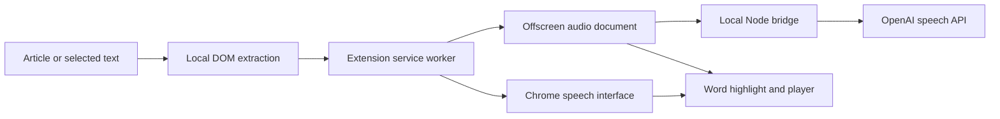

# How Tempo works

Tempo is a Manifest V3 Chrome extension with an optional local Node speech bridge. The webpage remains the reading surface. Extraction and controls use ordinary JavaScript; only speech synthesis uses an AI model.

## Components

| File | Responsibility |
| --- | --- |
| `extension/manifest.json` | On-demand tab access, local bridge permission, and extension entrypoints |
| `extension/extractor.js` | Article scoring, noise filtering, selected text, DOM word ranges, and chunking |
| `extension/content.js` | Page session, keyboard controls, word seeking, and CSS highlights |
| `extension/ui.js` | Floating player isolated from page styles in a Shadow DOM |
| `extension/background.js` | Session coordination, settings, Chrome speech, and offscreen document lifecycle |
| `extension/offscreen.js` | OpenAI audio requests, buffering, playback, cancellation, and estimated timing |
| `server/server.mjs` | Loopback HTTP service, credential boundary, upstream requests, and audio cache |

## Extraction and highlighting

Clicking the extension grants `activeTab` access and injects the reader into that page. There is no persistent content script running across every site.

The extractor visits eligible visible text nodes, excluding common interface elements and noise patterns. It scores candidate article containers by text volume, link density, and semantic signals such as `<article>` and `<main>`. A selection narrows the text directly. The result is a sequence of words with DOM `Range` objects that can span inline elements.

CSS Custom Highlights draw the current word without wrapping or replacing the article's text nodes. Click-to-seek maps the clicked DOM position back to the extracted words. Links and interactive controls retain their usual click behavior. Pasted text has no matching page ranges, so it has audio controls but no article-word highlighting.

This is a heuristic extractor. It does not parse PDFs, images, cross-origin frames, or inaccessible shadow content. It does not reveal hidden or paywalled text. If the page replaces its DOM after extraction, reopen the reader to refresh the word map.

## Speech and latency

The first chunk targets about 25 words, with subsequent chunks targeting about 85. Sentence and paragraph boundaries guide splitting, subject to word and character limits. Small initial chunks reduce time to first audio; larger later chunks reduce request overhead.

Browser mode routes through `chrome.tts`. It requires an installed non-remote voice and follows available word events. Speed changes or seeking restart speech from the current word.

OpenAI mode uses an offscreen document so changing tabs does not destroy the audio player. It requests complete WAV chunks from the local bridge, with at most two extension-side requests running concurrently and three chunks of lookahead. The client keeps a small moving cache around the current passage. Stop and model/voice changes clear this cache and cancel pending requests; seeking reprioritizes the requested chunk. Pause can allow existing bounded prefetch work to finish.

The bridge requests speech at native speed. Playback uses `HTMLAudioElement.playbackRate` with pitch preservation, so changing speed does not require resynthesizing buffered audio. Each chunk is a separate audio element; transitions can have gaps, especially when listening faster than speech can be generated. This is chunked playback, not token-by-token audio streaming.

## Word timing

OpenAI WAV responses do not provide word boundaries in this implementation. Tempo estimates them by distributing the chunk's measured duration across words, weighting word length and punctuation. The player's audio clock determines the highlighted word, and seeking uses those same estimated offsets.

This supports fast navigation without a transcription or alignment request, but is not exact synchronization. A click can land slightly before or after the spoken word. The displayed remaining time is also an estimate based on word count and playback speed.

## State and cancellation

The service worker coordinates one active reading session per Chrome profile. Persistent preferences live in `chrome.storage.local`; current session data uses `chrome.storage.session`. Opening another article replaces the active session. Closing or navigating the source tab stops it.

Audio operations carry generation and operation counters so late responses cannot start an obsolete session or undo a pause. Aborted requests release object URLs and stop retaining canceled chunks. A separate server cache retains up to 32 MiB of completed audio in memory, keyed by model, voice, and text, so repeating an available chunk can avoid an upstream request.

## Security and data flow

The API key is read only by the local Node process, from `OPENAI_API_KEY` or a private environment file. It is never returned by the health endpoint or passed to Chrome. The service binds to `127.0.0.1:43123`, validates the Host header, rejects non-extension browser origins, and requires a custom client header. `READER_EXTENSION_IDS` optionally restricts access to a comma-separated list of specific extensions. Without that setting, other Chrome extension origins are permitted. Local programs are part of the trusted-machine boundary.

Requests validate model/voice combinations and text size. The bridge has concurrency, character-rate, and upstream timeout limits. These reduce accidental overload; they are not a billing cap. Requests already processed upstream may incur charges even if canceled locally.

OpenAI receives spoken text and a small amount of prefetched text, the selected model/voice, and narration instructions where supported. No page HTML, cookies, or API key is exposed to the article page. The bridge stores audio only in memory and avoids returning raw upstream error bodies. Its cache clears on process exit.

The expressive model is instructed to read supplied text verbatim, pronounce technical language carefully, and treat article text as content rather than instructions. No reasoning model processes or summarizes the article before narration.

## Validation

`npm test` runs Node tests with DOM and audio mocks. Tests exercise extraction, controls, audio lifecycle behavior, and bridge validation without making paid requests. `npm run check` validates JavaScript syntax and the extension manifest. Real Chrome testing is still needed for browser permissions, installed voice behavior, audio output, and site-specific layouts.
