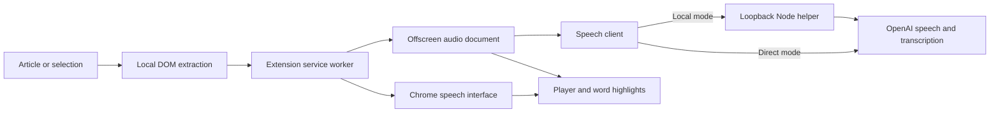

# How Hermes works

Hermes is a Manifest V3 Chrome extension. It extracts article text locally, keeps the webpage as the reading surface, and offers native browser speech or OpenAI narration. OpenAI can be called directly from Chrome or through an optional local Node helper.

## Components

| File | Responsibility |
| --- | --- |
| `extension/manifest.json` | On-demand tab access, local helper permission, optional OpenAI permission |
| `extension/extractor.js` | Article scoring, noise filtering, DOM word ranges, and chunking |
| `extension/content.js` | Page session, keyboard controls, word seeking, and CSS highlights |
| `extension/ui.js` | Draggable, dockable, collapsible player isolated in a Shadow DOM |
| `extension/background.js` | Trusted storage access, settings, session coordination, native speech, and audio lifecycle |
| `extension/session-data.js` | Session-only credentials, voice guidance, and audio encryption key; migration of prior persistent secrets |
| `extension/speech-client.js` | Direct/helper routing, speech requests, and optional transcription |
| `extension/offscreen.js` | Audio requests, buffering, playback, cancellation, and timing updates |
| `extension/audio-cache.js` | Bounded, encrypted audio and numeric timing storage in IndexedDB |
| `extension/timing.js` | WAV inspection, estimated boundaries, and transcript-to-source matching |
| `extension/options.js` | Connection setup, optional permission request, local key import, and voice defaults |
| `server/server.mjs` | Optional loopback service, upstream requests, and bounded audio cache |

## Extraction and interaction

Invoking Hermes grants `activeTab` access and injects the reader into that page. No persistent content script runs across every site. The extractor visits eligible visible text nodes, filters common interface elements and noise patterns, then scores candidate article containers using text volume, link density, and semantic signals. A selection limits extraction directly.

Substack's `article.newsletter-post` is article content, not a newsletter signup widget. When its `.available-content .body.markup` structure is present, Hermes uses the post title, subtitle, and visible body instead of generic density scoring. This keeps short and link-heavy posts separate from publication footers, author controls, signup blocks, and recommendations, including on custom domains. Hidden, inert, and paywall exclusions still apply; selection-based reading is unchanged.

Words retain DOM `Range` objects that can span inline markup. CSS Custom Highlights mark the current word without replacing or wrapping the article's text nodes. Double-click seeking maps the selected DOM position back to those ranges; single clicks, links, and interactive controls retain their normal behavior. Pasted text has no page ranges. If a site replaces its content after extraction, reopen Hermes to refresh the map.

The toolbar speed button cycles 1×, 1.5×, 2×, and 4× directly; settings offer a continuous 0.75×–4× slider. Dropping the drag handle or collapsed button within 48 pixels of an edge snaps to it. Left/right docking is vertical; top/bottom docking is horizontal. Manual position controls provide the same choices.

Auto-scroll tracks the word's range, not the whole paragraph, and checks scrollable ancestors as well as the viewport. It scrolls before the word reaches the lower reading boundary and accounts for overlap with the player. Wheel or touch scrolling holds automatic following for 1.2 seconds; following then resumes on playback updates. Reduced-motion preferences disable smooth scrolling.

This is a heuristic HTML reader. It does not parse PDFs, images, cross-origin frames, or inaccessible shadow content, and it does not reveal hidden or paywalled text.

## Speech, timing, and latency

The first chunk targets about 25 words; subsequent chunks target about 85. Sentence and paragraph boundaries guide splitting within word and character limits. No language model summarizes or rewrites the source.

Browser mode uses `chrome.tts`, requires an installed non-remote voice, and consumes native word events when provided. Changing speed or seeking restarts speech from the current word. Its remaining-time estimate uses word count and the selected rate.

OpenAI mode reuses saved WAV chunks when available, otherwise requesting speech at native speed through `speech-client.js`. `gpt-4o-mini-tts` receives verbatim-reading instructions plus up to 1,000 characters of user pronunciation/delivery guidance. The legacy `tts-1` and `tts-1-hd` paths omit those instructions. Playback uses `HTMLAudioElement.playbackRate` with pitch preservation. Speed changes never trigger an API request and are excluded from the saved-audio key. This is chunked playback, not token-level audio streaming; generation and chunk transitions can still cause waits. See the [OpenAI speech guide](https://developers.openai.com/api/docs/guides/text-to-speech).

Estimated word boundaries use WAV duration, detected edge silence, word length, and punctuation. Optional improved timing sends the generated audio to `whisper-1` with `verbose_json` and word timestamps. This work runs separately from speech preparation and never blocks first playback. A deterministic matcher aligns transcript tokens to the original text, allowing split acronyms, merged words, and small transcription differences. Low-coverage or invalid results are rejected; estimates remain available. Alignment adds API usage and improves navigation without guaranteeing exact word boundaries. See the [OpenAI transcription guide](https://developers.openai.com/api/docs/guides/speech-to-text).

The audio clock drives highlighting and seeking. The minutes:seconds display combines measured remaining durations for buffered chunks with an estimate for ungenerated words, adjusted for speed. A measured chunk does not make the whole article's remaining time exact.

## Resource use and lifecycle

The extension allows two speech requests and one alignment request concurrently, with up to three future chunks prepared. It retains a moving RAM cache around the current passage and caps retained audio blobs at **12 MiB**. That cap does not include browser overhead, transient request buffers, decoded audio, source text, or DOM ranges; it is not a total-RAM guarantee.

A separate IndexedDB cache has a **32 MiB audio-size budget** and **256-entry** limit, with a **seven-day maximum lifetime**. Ciphertext and storage metadata add overhead beyond that audio budget. Audio and numeric timings are encrypted with AES-256-GCM; the encryption key exists only in browser-session memory. Closing the reader does not destroy that key, but quitting Chrome does. Consequently, saved audio can be reused within the same browser session, not across browser restarts. Earlier plaintext cache records are purged during the database upgrade.

Least-recently-used entries are evicted when either size limit is reached. Expired entries are rejected on reads and removed during cache maintenance. There is no background timer keeping the extension awake for disk expiry; expired or no-longer-decryptable ciphertext may remain until the next cleanup or explicit clear. Chrome may independently evict stored data.

The lookup key hashes the cache format version, model, voice, text, and applicable voice instructions. It excludes playback speed. The encrypted payload contains completed validated audio, duration, and numeric estimated/aligned boundaries; storage metadata supports expiry and eviction. No API keys, plaintext source text, article URLs, or transcription text are written to the cache. Successful speech and alignment are saved without making playback wait for the write. Unavailable storage or quota errors fall back to normal speech requests. **Clear saved audio** in Options removes the extension's encrypted entries; the optional helper has its own memory cache. Active reading can create new entries after a clear.

The offscreen document is created when OpenAI playback needs it. Stop, close, and leaving the source document release it; a three-minute idle alarm also releases it after paused, ended, or error states. Saved audio survives that release. Playback restores cached audio or prepares it again as needed. The 40 ms word-update timer exists only during playback, so the extension does not poll its audio position while idle. Prefetch work already in flight can finish during a pause.

One reading session is active per Chrome profile. Nonsecret preferences and layout use `chrome.storage.local`. The direct-mode API key, custom voice guidance, encryption key, source text, current article title/URL, and compact playback state use browser-session memory, including `chrome.storage.session`. None use Chrome Sync. Source text is saved on load rather than rewritten at every word update. Opening another article replaces the session. A same-document or fragment navigation preserves it while the original reader answers a session probe. Full document replacement or tab closure stops playback.

If a control request finds a stale background session, the content script reloads its current article at the saved word and retries play, seek, or settings. Concurrent retries share one reconnect operation. This recovery applies while the source page and its reader remain available; it is not a cross-browser reading-history feature.

Generation and operation counters prevent late responses from starting stale playback or undoing a pause. Stop and voice/model/guidance changes cancel pending work and clear relevant RAM audio. Saved chunks remain available under their own model/voice/guidance keys. Seeking cancels distant prefetch and prioritizes the target passage. Released RAM entries revoke object URLs.

The optional helper caches up to **16 MiB** of audio, keyed by model, voice, text, and guidance, with a ten-minute expiry checked on requests and by a lightweight periodic sweep. Cached word timestamps can be reused alongside audio. The cache is memory-only and clears when the process exits.

## Credentials and request boundaries

**Consent:** the Options disclosure explains that OpenAI receives narration text, limited prefetched text, applicable voice guidance, and generated audio when improved timing is enabled. An explicit checkbox records the user's agreement. The speech client checks consent at the request boundary before speech or alignment requests in both direct and local-helper modes. Installed native speech does not require OpenAI consent. Trusted-event guards reject webpage-generated synthetic actions that could trigger paid reading controls.

**Direct mode:** a deliberate Save connection action requests optional access to `https://api.openai.com/*`. The API key and custom voice guidance use `chrome.storage.session`, not persistent local storage or Sync. Quitting Chrome ends their lifetime. Storage access is restricted to trusted extension contexts; content scripts receive settings and status rather than API credentials. The offscreen document obtains connection details through a sender-checked internal message. Importing an environment file reads it locally without uploading the file. Forgetting the key also removes the optional permission. A ready configuration is not proof of a valid key; OpenAI validates it on a real request.

Initialization migrates any key or custom guidance left by older versions into session storage and removes those fields from persistent local storage. Nonsecret connection mode and consent remain persistent preferences.

**Local helper:** Node reads `OPENAI_API_KEY` from the environment or a private environment file. The key stays outside Chrome. The service binds to `127.0.0.1:43123`, validates Host and the custom client header, and rejects non-extension browser origins. `READER_EXTENSION_IDS` optionally limits allowed extension IDs; otherwise Chrome extension origins are permitted. Local programs remain within the trusted-machine boundary. Node 22+ is needed only for this optional helper and repository development.

OpenAI receives narration text, limited prefetched text, and applicable voice guidance; improved timing additionally sends generated audio. Requests use fixed HTTPS OpenAI API endpoints. Hermes does not send page HTML, cookies, or article title/URL as API metadata, although narrated text may itself contain URLs or sensitive information. The expressive model is instructed to treat page text as content to read, not commands. No reasoning model processes the article first.

The encrypted audio database is local to the extension's Chrome profile and is not synced. Its session-only key protects saved narration at rest while allowing reuse after the reader closes. Decrypted audio exists in memory during use. Forgetting an API key, clearing encrypted audio, and deleting an optional helper environment file are separate actions.

The extension sends no reading data or credentials to its developer. There is no developer account system, telemetry, advertising, or browsing-history log. All runtime JavaScript is bundled; API responses are audio and data, never remotely executed code. The full data-flow and retention notice is in [PRIVACY.md](../PRIVACY.md).

Both paths bound response sizes and sanitize upstream errors. The helper additionally validates input and applies concurrency, character-rate, and timeout limits. These controls are not a billing cap, and canceled requests may already have incurred usage. Environment and common credential files are excluded from Git; no API key is bundled in the extension package.

## Validation

`npm test` exercises extraction, controls, settings, timing, audio lifecycle, and helper behavior with mocked speech responses. `npm run check` checks JavaScript syntax and extension assets; `npm run check:secrets` scans tracked files for common credential patterns without printing secret values. `npm run package` scans the exact packaged bytes, including untracked assets, and produces both an unpacked-install ZIP and a Chrome Web Store ZIP with `manifest.json` at its root. Real Chrome checks remain necessary for permissions, installed voices, audio output, and website layouts.
