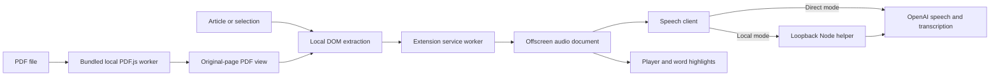

# How Hermes works

Hermes is a Manifest V3 Chrome extension. It extracts article text locally, keeps the webpage as the reading surface, and uses OpenAI for all narration. OpenAI can be called directly from Chrome or through an optional local Node helper.

```mermaid
flowchart LR
    Page[Article or selection] --> Extract[Local DOM extraction]
    Extract --> Worker[Extension service worker]
    Worker --> Audio[Offscreen audio document]
    Audio --> Client[Speech client]
    Client -->|Direct mode| API[OpenAI speech and transcription]
    Client -->|Local mode| Helper[Loopback Node helper]
    Helper --> API
    Audio --> Player[Player and word highlights]
    PDF[PDF file] --> Parser[Bundled local PDF.js worker]
    Parser --> View[Original-page PDF view]
    View --> Extract
```

## Components

| File | Responsibility |
| --- | --- |
| `extension/manifest.json` | On-demand tab access, local helper permission, optional OpenAI permission |
| `extension/pdf.html`, `pdf.js`, `pdf-text.mjs`, `pdf-narration.mjs`, `pdf-view.mjs` | On-demand PDF import, local text layout and citation filtering, original-page rendering, and source-coordinate highlighting |
| `extension/extractor.js` | Article scoring, noise filtering, DOM word ranges, and chunking |
| `extension/content.js` | Page session, keyboard controls, word seeking, and CSS highlights |
| `extension/ui.js` | Draggable, dockable, collapsible player isolated in a Shadow DOM |
| `extension/background.js` | Trusted storage access, settings, session coordination and API audio lifecycle |
| `extension/session-data.js` | Serializes credential operations, restores remembered credentials, and holds session-only guidance and audio encryption keys |
| `extension/credential-vault.js` | Opt-in AES-256-GCM credential storage with a non-exportable CryptoKey in a separate IndexedDB database |
| `extension/speech-client.js` | Direct/helper routing, speech requests, and optional transcription |
| `extension/offscreen.js` | Audio requests, buffering, playback, cancellation, and timing updates |
| `extension/audio-cache.js` | Bounded, encrypted audio and numeric timing storage in IndexedDB |
| `extension/timing.js` | WAV inspection, estimated boundaries, and transcript-to-source matching |
| `extension/options.js` | Connection setup, optional permission request, local key import, and voice defaults |
| `server/server.mjs` | Optional loopback service, upstream requests, and bounded audio cache |

## Extraction and interaction

Invoking Hermes grants `activeTab` access and injects the reader into that page. No persistent content script runs across every site. The extractor visits eligible visible text nodes, filters common interface elements and noise patterns, then scores candidate article containers using text volume, link density, and semantic signals. A selection limits extraction directly.

Substack's `article.newsletter-post` is article content, not a newsletter signup widget. When its `.available-content .body.markup` structure is present, Hermes uses the post title, subtitle, and visible body instead of generic density scoring. This keeps short and link-heavy posts separate from publication footers, author controls, signup blocks, and recommendations, including on custom domains. Hidden, inert, and paywall exclusions still apply; selection-based reading is unchanged.

Words retain DOM `Range` objects that can span inline markup. CSS Custom Highlights mark the current word without replacing or wrapping the article's text nodes. Double-click seeking maps the selected DOM position back to those ranges; single clicks, links, and interactive controls retain their normal behavior. Pasted text has no page ranges. If a site replaces its content after extraction, reopen Hermes to refresh the map.

The toolbar speed button advances through smaller steps (2.3×, 2.5×, 2.7×, 3×, 3.3× and onward to 7×); Shift-click decreases. Settings offer a 0.75×–7× slider with 0.05× steps. Dropping the drag handle or collapsed button within 48 pixels of an edge snaps to it. Left/right docking is vertical; top/bottom docking is horizontal. Manual position controls provide the same choices.

Auto-scroll tracks the word's range, not the whole paragraph, and checks scrollable ancestors as well as the viewport. It scrolls before the word reaches the lower reading boundary and accounts for overlap with the player. Wheel or touch scrolling holds automatic following for 1.2 seconds; following then resumes on playback updates. Reduced-motion preferences disable smooth scrolling.

HTML extraction is heuristic. Images, cross-origin frames, and inaccessible shadow content are not extracted, and hidden or paywalled text is not revealed. Selectable PDFs use the separate local PDF reader described below.

## Speech, timing, and latency

The first chunk targets about 25 words; subsequent chunks target about 85. Sentence and paragraph boundaries guide splitting within word and character limits. No language model summarizes or rewrites the source.

Version 0.5.0 removes the browser speech path and the `tts` permission. New installs default to direct OpenAI with Alloy and `gpt-4o-mini-tts`; older browser-voice preferences normalize to the same model. Existing explicit local-helper connections remain supported. Missing connection or consent shows a setup prompt before creating an audio document, with no native fallback.

OpenAI mode reuses saved WAV chunks when available, otherwise requesting speech through `speech-client.js` with `speed: generationSpeed`. The preferred generation rate defaults to 2.3 and is limited to 0.75–4 in Hermes. `gpt-4o-mini-tts` receives verbatim-reading instructions plus up to 1,000 characters of user pronunciation/delivery guidance. The legacy `tts-1` and `tts-1-hd` paths omit those instructions. Playback uses `HTMLAudioElement.playbackRate = speed / generationSpeed` with pitch preservation, where `speed` is the effective rate displayed on the toolbar. Ordinary playback changes never trigger a speech request and are excluded from the saved-audio key. Changing generation speed invalidates active audio, retains the current word, and regenerates or reuses a matching recording when playback is requested. The UI also sets playback speed to the new generation speed. Opening a new reader starts at the preferred generation rate. This is chunked playback, not token-level audio streaming; generation and chunk transitions can still cause waits. See the [OpenAI speech guide](https://developers.openai.com/api/docs/guides/text-to-speech).

Estimated word boundaries use WAV duration, detected edge silence, word length, and punctuation. Optional improved timing sends the generated audio to `whisper-1` with `verbose_json` and word timestamps. This work runs separately from speech preparation and never blocks first playback. A deterministic matcher aligns transcript tokens to the original text, allowing split acronyms, merged words, and small transcription differences. Low-coverage or invalid results are rejected; estimates remain available. Alignment adds API usage and improves navigation without guaranteeing exact word boundaries. See the [OpenAI transcription guide](https://developers.openai.com/api/docs/guides/speech-to-text).

The audio clock drives highlighting and seeking. Word boundaries stay in source-audio seconds, so playback-speed changes never rescale or recompute alignment. The minutes:seconds display converts measured chunk durations back to nominal 1× seconds using their generation rate, combines them with an estimate for ungenerated words, then divides by effective playback speed. A measured chunk does not make the whole article's remaining time exact. Generation rates are nominal: independent model responses can have slightly different phrasing and durations.

## Resource use and lifecycle

The extension allows two speech requests and one alignment request concurrently, with up to three future chunks prepared. It retains a moving RAM cache around the current passage and caps retained audio blobs at **12 MiB**. That cap does not include browser overhead, transient request buffers, decoded audio, source text, or DOM ranges; it is not a total-RAM guarantee.

A separate IndexedDB cache has a **32 MiB audio-size budget** and **256-entry** limit, with a **seven-day maximum lifetime**. Ciphertext and storage metadata add overhead beyond that audio budget. Audio and numeric timings are encrypted with AES-256-GCM; the encryption key exists only in browser-session memory. Closing the reader does not destroy that key, but quitting Chrome does. Consequently, saved audio can be reused within the same browser session, not across browser restarts. Earlier plaintext cache records are purged during the database upgrade.

Least-recently-used entries are evicted when either size limit is reached. Expired entries are rejected on reads and removed during cache maintenance. There is no background timer keeping the extension awake for disk expiry; expired or no-longer-decryptable ciphertext may remain until the next cleanup or explicit clear. Chrome may independently evict stored data.

The lookup key hashes the cache format version, model, voice, text, applicable voice instructions, and generation speed (preserving the previous key for 1× recordings). It excludes playback speed. The encrypted payload contains completed validated audio, duration, and numeric estimated/aligned boundaries; storage metadata supports expiry and eviction. No API keys, plaintext source text, article URLs, or transcription text are written to the cache. Successful speech and alignment are saved without making playback wait for the write. Unavailable storage or quota errors fall back to normal speech requests. **Clear saved audio** in Options removes the extension's encrypted entries; the optional helper has its own memory cache. Active reading can create new entries after a clear.

The offscreen document is created when OpenAI playback needs it. Stop, close, and leaving the source document release it; a three-minute idle alarm also releases it after paused, ended, or error states. Saved audio survives that release. Playback restores cached audio or prepares it again as needed. The 40 ms word-update timer exists only during playback, so the extension does not poll its audio position while idle. Prefetch work already in flight can finish during a pause.

One reading session is active per Chrome profile. Nonsecret preferences and layout use `chrome.storage.local`. The active direct-mode API key, custom voice guidance, audio encryption key, source text, current article title/URL, and compact playback state use browser-session memory, including `chrome.storage.session`. An optional encrypted credential copy can restore the API key after a restart, as described below. None use Chrome Sync. Source text is saved on load rather than rewritten at every word update. Opening another article replaces the session. A same-document or fragment navigation preserves it while the original reader answers a session probe. Full document replacement or tab closure stops playback.

If a control request finds a stale background session, the content script reloads its current article at the saved word and retries play, seek, or settings. Concurrent retries share one reconnect operation. This recovery applies while the source page and its reader remain available; it is not a cross-browser reading-history feature.

Generation and operation counters prevent late responses from starting stale playback or undoing a pause. Stop and voice/model/guidance changes cancel pending work and clear relevant RAM audio. Saved chunks remain available under their own model/voice/guidance keys. Seeking cancels distant prefetch and prioritizes the target passage. Released RAM entries revoke object URLs.

The optional helper caches up to **16 MiB** of audio, keyed by model, voice, text, and guidance, with a ten-minute expiry checked on requests and by a lightweight periodic sweep. Cached word timestamps can be reused alongside audio. The cache is memory-only and clears when the process exits.

## PDF reading

The toolbar recognizes `.pdf` and arXiv `/pdf/` URLs before trying content-script injection, and probes ordinary pages for PDF MIME types or embedded viewers. It opens an extension-owned `pdf.html` tab, which fetches the source using the temporary active-tab host grant. No broad host permission is added. Keep the original tab open during fetch. Restricted hosts, redirects, extensionless URLs Chrome refuses to probe, and local files have an explicit file-picker fallback in Options.

PDF.js 6.4.299 is bundled with its worker, CMaps, fallback fonts, non-WASM image decoders, and upstream licenses. These load only in the PDF reader. Evaluation, XFA, and WASM remain disabled. Text is extracted sequentially, repeated margins and typesetting hyphens are cleaned, and common column order is estimated. The live document worker is retained for page rendering and destroyed on replacement, failure, or page exit. Limits are 50 MiB, 500 pages, and two million extracted characters; source bytes are not persisted.

The visual and narration layers are separate. Canvas rendering preserves the PDF's original figures, tables, and typography. PDF.js TextLayer supplies selectable source text. `pdf-narration.mjs` masks citations while preserving offsets, removes linked superscript footnote markers at extraction, optionally filters footnotes/captions/references, and translates recognized boolean comparison tables into rows with column labels and yes/no values. Every spoken token carries source item and character coordinates, including words joined across line-end hyphens and normalized ligatures. No model is used to rewrite the paper. These filters are heuristic; complex tables, equations, and atypical layouts can still read imperfectly.

`pdf-view.mjs` mounts at most three nearby pages, each canvas capped near three million pixels. Off-screen canvases and text layers are cancelled and released; source coordinates remain available for seeking and follow-scroll before the page renders. Text ranges produce highlight rectangles on rendered pages. A viewport-transform fallback supports off-screen scrolling. The canvas working set is about 36 MB maximum, excluding document data, decoded images, fonts, text, and browser overhead.

The PDF adapter feeds chunks into the shared player without sending its coordinate data to the background. Filter changes retain the current source word when it survives filtering. Runtime messages carry the reader tab ID; the service worker checks it against the sender document and tab in Chrome's trusted extension-context inventory when Chrome omits `sender.tab`. Playback events are addressed to that reader tab and session. The PDF page cannot retrieve API credentials through the internal connection routes. Closing or replacing the PDF stops the old session.
